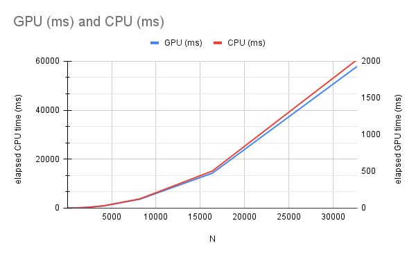
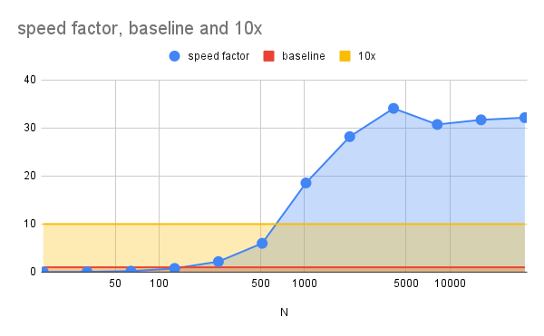

# HIP Mandelbrot
GPU Implementation of Mandelbrot Fractal Generator with Benchmarking using [AMD HIP SDK](https://github.com/ROCm-Developer-Tools/HIP).

Computes for the Mandelbrot set in the complex plane bounded by the rectangular corners (-2.0, -2.0) to (2.0, 2.0).

## Usage
```cmd
To use:

[Command Prompt] HIPMandelbrot.exe [WIDTH] [HEIGHT]

or

[Command Prompt] HIPMandelbrot.exe [N]
```

## Sample Run

```cmd
[Command Prompt] HIPMandelbrot.exe 32768 32768

Device: AMD Radeon RX 7800 XT

Estimated GPU RAM requirements: 4294967296 bytes
Total GPU RAM: 17163091968 bytes
Program GPU RAM Limit: 8589934592 bytes
Size of int: 4 bytes

generating mandelbrot set using GPU ...
GPU elapsed time: 1931.32 ms
generating mandelbrot set using CPU ...
CPU elapsed time: 60691.2 ms

31.4247x speedup, errors: 288
```

## Benchmarks

|N|GPU (ms)|CPU (ms)|speed factor|status|
|-|--------|--------|------------|------|
|16|1.4611|0.024|0.01642598043|slower|
|32|1.4162|0.0687|0.04851009744|slower|
|64|1.5048|0.2563|0.1703216374|slower|
|128|1.482|0.9973|0.6729419703|slower|
|256|1.732|3.8892|2.245496536|faster|
|512|2.2863|15.1371|6.620784674|faster|
|1024|3.2607|59.7921|18.33719753|faster|
|2048|8.7413|238.792|27.31767586|faster|
|4096|29.7729|949.678|31.89739663|faster|
|8192|121.111|3791.4|31.30516634|faster|
|16384|476.03|15152.9|31.83181732|faster|
|32768|1931.32|60691.2|31.42472506|faster|

where:
- **N** - length of the square image's side (in pixels)
- **speed factor** - ratio between CPU and GPU elapsed times (**CPU**/**GPU**)

**Test Machine**
- CPU: Ryzen 5700x (8 core/16 threads)
- 32GB 3200MT/s CL16 DDR4
- Gigabyte B550I AORUS PRO AX rev 1.2
- GPU: Sapphire Pulse 7800xt 16GB GDDR6

## Graphs

### Elapsed Time


### Speed Comparison (and baselines)


## To Do
- PNG Image Output
- User defined parameters
- Implement other fractal generators