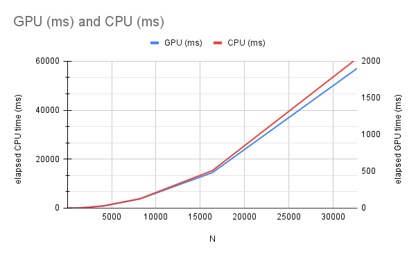

# HIP Mandelbrot
GPU Implementation of Mandelbrot Fractal Generator with Benchmarking using [AMD HIP SDK](https://github.com/ROCm-Developer-Tools/HIP).

Computes for the Mandelbrot set in the complex plane bounded by the rectangular corners (-2.0, -2.0) to (2.0, 2.0).

## Usage
```cmd
To use:

[Command Prompt] HIPMandelbrot.exe [WIDTH] [HEIGHT]

or

[Command Prompt] HIPMandelbrot.exe [N]
```

## Sample Run

```cmd
[Command Prompt] HIPMandelbrot.exe 32768 32768

Device: AMD Radeon RX 7800 XT

Estimated GPU RAM requirements: 4294967296 bytes
Total GPU RAM: 17163091968 bytes
Program GPU RAM limit: 8589934592 bytes
Size of int: 4 bytes

generating mandelbrot set using GPU ...
GPU elapsed time: 1903.98 ms
generating mandelbrot set using CPU ...
CPU elapsed time: 61218.6 ms

32.153x speedup, diff: 288
```

## Benchmarks

|N|GPU (ms)|CPU (ms)|speed factor|status|
|-|--------|--------|------------|------|
|16|1.4344|0.024|0.0199|slower|
|32|1.5457|0.0865|0.0559617002|slower|
|64|1.5693|0.3231|0.2058879755|slower|
|128|1.5188|1.1664|0.7679747169|slower|
|256|1.9443|4.247|2.184333693|faster|
|512|2.6105|15.6552|5.997012067|faster|
|1024|3.4076|63.2497|18.56136284|faster|
|2048|8.6175|243.014|28.20005802|faster|
|4096|28.2254|962.061|34.08493768|faster|
|8192|124.929|3839.13|30.73049492|faster|
|16384|483.53|15327.6|31.69937749|faster|
|32768|1903.98|61218.6|32.15296379|faster|

where:
- **N** - length of the square image's side (in pixels)
- **speed factor** - ratio between CPU and GPU elapsed times (**CPU**/**GPU**)

**Test Machine**
- CPU: Ryzen 5700x (8 core/16 threads)
- 32GB 3200MT/s CL16 DDR4
- Gigabyte B550I AORUS PRO AX rev 1.2
- GPU: Sapphire Pulse 7800xt 16GB GDDR6

## Graphs

### Elapsed Time


### Speed Comparison (and baselines)


### Sample output (converted from PGM and PPM to PNG)

#### RGB (2048 x 2048)


#### Gray (2048 x 2048)


## To Do
- PNG Image Output
- User defined parameters
- Implement other fractal generators